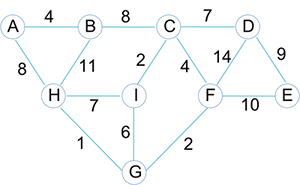

# Problem Set 12 - Graphs: Topological Sorting, Traversal, Dijkstra's Algorithm

## Problem 1

You are given a directed graph:

```java
class Neighbor {
   public int      vertex;
   public Neighbor next;
   // ...
}
```

```java
class Vertex {
   String   name;
   Neighbor neighbors; // adjacency linked lists for all vertices
}
```

```java
public class Graph {
   Vertex[] vertices;

   // returns an array of indegrees of the vertices, i.e. return[i] is the
   // number of edges that are directed IN TO vertex i
   public int[] indegrees() {
      // FILL IN THIS METHOD
   }
}
```

1. Assuming that the graph has already been read in, complete the `indegrees` method.
2. What is the big O running time of your `indegrees` implementation if the graph has `n` vertices and `e` edges? Show your analysis.

## Problem 2

With the same `Graph` class as in the previous example, assuming that the graph is acyclic, and that that the indegrees method has been implemented, implement a `topsort` method to toplogically sort the vertices **using BFS (breadth-first search)** (see algorithm in Section 14.4.4 of text):

```java
public class Graph {
   // ...
   public String[] indegrees() {
      // Already implemented
   }

   // returns an array with the names of vertices in topological sequence
   public String[] topsort() {
      // COMPLETE THIS METHOD
   }
}
```

You may use the following `Queue` class:

```java
import java.util.NoSuchElementException;

public class Queue<T> {
   // ...
   public Queue() {
      // ...
   }

   public void enqueue(T item) {
      // ...
   }

   public T dequeue() throws NoSuchElementException {
      // ...
   }

   public boolean isEmpty() {
      // ...
   }
   // ...
}
```

## Problem 3

A _strongly connected_ directed graph is one in which every vertex can reach all other vertices. In the following `Graph` class, implement a method `stronglyConnected` that returns true if the graph is strongly connected, and false otherwise. What is the worst case big O running time of your implementation?

```java
public class Graph {
   Vertex[] vertices;

   // performs a recursive dfs starting at vertex v
   private void dfs(int v, boolean[] visited) {
      // Already implemented
   }

   public boolean stronglyConnected() {
      // COMPLETE THIS METHOD
   }
}
```

## Problem 4

Suppose you are given this undirected graph in which the vertices are towns, and the edges are toll roads between them. The weight of an edge is the dollar amount of toll.



Use Dijsktra's shortest paths algorithm to determine the minimum toll route from `A` to all other cities.

-  Show each step of the algorithm in tabular form. Here's the table after the initial step:

   ```
    Done   D[B]    D[C]    D[D]    D[E]    D[F]    D[G]    D[H]    D[I]
   ---------------------------------------------------------------------
     A     4, A      ∞       ∞       ∞       ∞       ∞     8, A     ∞
   ```

   Note that along with the distance, the "previous" vertex is also shown.

-  Draw the shortest path tree induced on the graph. The shortest path tree is a general tree (a node can have any number of children) that consists of all the vertices of the graph, and the edges that are in the shortest paths to all the vertices. The root of the tree is the source vertex for the algorithm.
